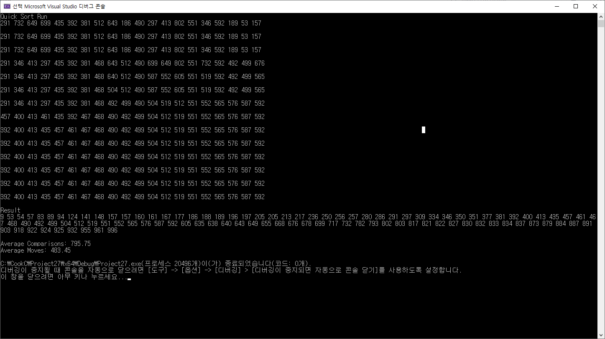

# QuickSort {ResultImage}

퀵정렬은  O(n log n) 의 평균 시간 복잡도로, 선택 정렬, 삽입 정렬, 버블 정렬의 평균 시간 복잡도(O(n²))보다 훨씬 빠르다. 쉘 정렬은 평균시간 복잡도가 O(n³/2) 로, 퀵 선택, 삽입, 버블 정렬보다는 성능이 좋지만 퀵정렬 보다는 느리다. 또한 간격을 두고 삽입 정렬을 반복하는 방식이라 데이터가 비교적 정렬된 상태일 때는 효과적일 수 있지만, 퀵소트처럼 분할 정복 방식으로 데이터를 처리하지 않기 때문에 최악의 경우 성능이 더 떨어질 수 있다. 합병 정렬은 O(n log n) 으로 퀵소트와 비슷하지만 추가 공간을 필요로 한다.
따라서, 퀵소트는 평균 성능 면에서 선택, 삽입, 버블 정렬보다 우수하고, 합병 정렬과 비슷한 성능을 보이며, 메모리 사용 면에서는 더 효율적입니다.
