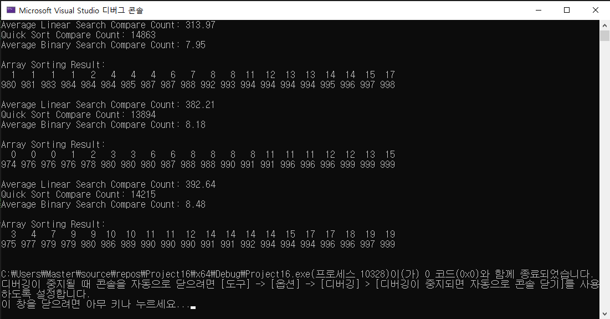

# compareSearches <Result Image>

퀵 정렬 이후 이진 탐색은 정렬된 배열에서 탐색 범위를 매번 반으로 줄여나가기 때문에  전체 탐색과정에서 확인해야 할 요소가 급격이 줄어듭니다. 
하지만 순차탐색은 배열의 처음부터 끝가지 하나씩 비교해야 하기 때문에 비교횟수가 배열 크기에 비래합니다. 그러므로 이진탐색에서 순차탐색보다 적게 비교합니다.
