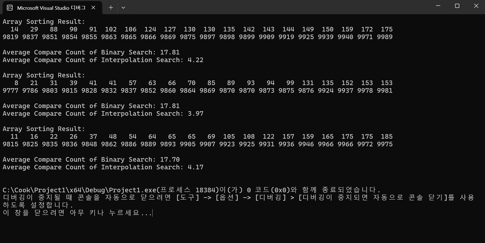

# interpolationSearch {Result Image}

Binary Serch는 값이 배열의 어느 위치에 있을지 알 수 없기 때문에 항상 중간값을 기준으로 탐색을 진행하며, 각 비교에서 범위를 절반씩 축소합니다. 이 방식은 배열의 값들이
균등하게 분포되어 있든, 그렇지 않든 항상 O(log N)의 비교횟수를 가집니다. 
반면, Interpolation Search는 배열 값들이 균등되게 분포되어 있다는 가정 하에, 검색하려는 값이 배열의 어느 위치에 있을지를 추정하여 그 위치를 기준으로 탐색을 시작합니다. 
값이 배열의 앞쪽에 있을 것 같으면 앞쪽을, 뒤쪽에 있을 것 같으면 뒤쪽을 탐색 범위로 좁히는 방식입니다. 따라서 값이 배열에서 어느위치에 예측할 수 있으므로 , 중간값을 선택하는 
Binary Serch보다 O(log log N)의 성능으로 더 작은 비교로 빠르게 값을 찾을 수 있습니다. 
